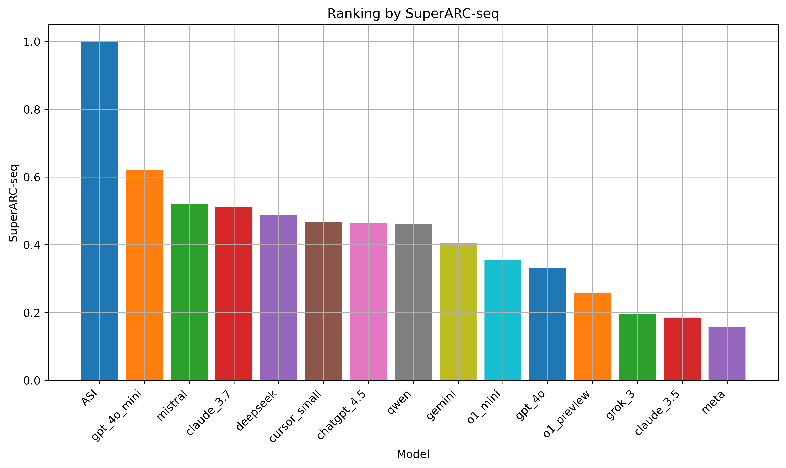

# Code for paper "An Agnostic Test for Narrow, General, and Super Intelligence Based On the Principles of Recursive Compression and Algorithmic Probability"

Code for paper [link](https://www.researchgate.net/publication/381114144_A_Test_of_Intelligence_for_Automated_Programming_Languages)

# The score

In general, when prompting an Large Language Model (LLM) to create a formula to reproduce a given sequence, when the result is correct, the following formula types are possible:

- Prints (the formular simply reproduced the target sequence without any attempt to encode or express it logically. This response type reflects a failure to abstract or deduce any underlying pattern, simply outputting the sequence as is).
- Ordinal (the formula provided a mapping based on the indices where '1's occur in the sequence. This response reflects an attempt by the model to analyse and map some logical structure to the sequence, making it more valuable than simply reproducing it verbatim. For integer sequences in general, a simple ASCII mapping was performed to convert from integers to binary encodings.)
- Non-Both (these responses avoided both simple reproduction and ordinal mapping, reflecting a more sophisticated approach to understanding and encoding the pattern. Such responses are the most valuable as they imply a deeper analysis and potentially creative logic to represent the sequence)

On the other hand, a fourth possible outcome is the case where the LLM was unable to reproduce the sequence correctly. Thus, the SuperARC-Seq score $\varphi$ can be calculated as:

```math
\varphi = \delta_1\rho_1 +\frac{\delta_2\rho_2}{10}+\frac{\delta_3\rho_3}{100}.
```

where:

- $\rho_1$ is the percentage of Correct \& Non-Prints \& Non-Ordinal results;
- $\rho_2$ is the percentage of Correct \& Ordinal results;
- $\rho_3$ is the percentage of Correct \& Prints results;
- $\rho_4$ is the percentage of Incorrect results;
- $\delta_i$, for $i = 1,2,3$ is a weighting factor determining how well the LLM compressed the original sequence and ranges from 0 (no compression) to 1 (perfect compression in an algorithmic sense). This weighting factor is calculated by using the principles of Algorithmic Information Theory.

It can be seen that $\sum \rho_i = 1$ and that $\varphi \in [0,1]$ encompasses different behaviours. For example, $\varphi \in [0,0.01]$ if only print-type models are outputted. Also, $\varphi \in [0,0.1]$ if only ordinal-like formulas are created. Finally, $\varphi \in [0,1]$ in cases where the LLMs create formulas that are always correct, do not copy nor create ordinal mappings. The ranges will be populated with varying compression levels corresponding to the algorithms obtained. Overall, if the score is 0, all the formulas were wrong. If it is 0.5, it can represent the case where half the outputs were correct and half wrong, with the formulas produced with highest compression levels. So, in a regular half and half case, since compression will not be optimal, the test score is less than 0.5.

# Leaderboard for SuperARC-Seq




| Model              | $\rho_1$ | $\rho_2$ | $\rho_3$ | $\rho_4$ | $\delta_1$ | $\delta_2$ | $\delta_3$ | $\varphi$ |
|--------------------|------------|------------|------------|------------|--------------|--------------|--------------|-------------|
| ASI (AIXI/BDM/CTM) | 1.000      | 0.000      | 0.000      | 0.000      | 1.000        | 0.000        | 1.000        | 1.000       |
| chatgpt\_4.5       | 0.00       | 1.00       | 0.0        | 0.00       | 0.000        | 0.419        | 0.000        | 0.042       |
| o1\_mini           | 0.00       | 0.64       | 0.0        | 0.36       | 0.000        | 0.537        | 0.000        | 0.034       |
| claude\_3.7        | 0.00       | 0.81       | 0.0        | 0.19       | 0.000        | 0.407        | 0.000        | 0.033       |
| claude\_3.5        | 0.06       | 0.14       | 0.0        | 0.80       | 0.449        | 0.428        | 0.000        | 0.033       |
| o1\_preview        | 0.00       | 0.29       | 0.0        | 0.71       | 0.000        | 0.423        | 0.000        | 0.012       |
| gpt\_4o\_mini      | 0.00       | 0.00       | 1.0        | 0.00       | 0.000        | 0.000        | 0.762        | 0.008       |
| cursor\_small      | 0.00       | 0.00       | 1.0        | 0.00       | 0.000        | 0.000        | 0.762        | 0.008       |
| gemini             | 0.00       | 0.00       | 1.0        | 0.00       | 0.000        | 0.000        | 0.762        | 0.008       |
| mistral            | 0.00       | 0.00       | 1.0        | 0.00       | 0.000        | 0.000        | 0.710        | 0.007       |
| qwen               | 0.00       | 0.00       | 1.0        | 0.00       | 0.000        | 0.000        | 0.710        | 0.007       |
| deepseek           | 0.00       | 0.00       | 1.0        | 0.00       | 0.000        | 0.000        | 0.710        | 0.007       |
| grok\_3            | 0.00       | 0.02       | 0.0        | 0.98       | 0.000        | 0.318        | 0.000        | 0.001       |
| gpt\_4o            | 0.00       | 0.00       | 0.0        | 1.00       | 0.000        | 0.000        | 0.000        | 0.000       |
| meta               | 0.00       | 0.00       | 0.0        | 1.00       | 0.000        | 0.000        | 0.000        | 0.000       |


Both the plot and the Leaderboard table show how most frontier models are close to each other in their performance and far from Artificial General Intelligence (AGI) or Artificial Super Intelligence (ASI) goals according to this test. ASI would be able to distinguish simpler from complex sequences and generate predictive models for each accordingly, as AIXI or Coding Theorem Method/Block Decomposition Method (CTM/BDM) would do as instantiations of universal AI hence ASI. Today, LLMs only produce or retrieve models for sequences that were seen and found in their original training sets, given that increasing the sequences' lengths impacts the LLM performance in identifying the sequence, hence indicating sequences are not recognised from first principles but from simplistic pattern matching.

It is important to notice that SuperARC-seq only takes into account binary sequences. Whenever integer sequences were considered, a clear biasing of the results was observed as LLMs started to take advantage of their training corpus to actually show memorization rather than abstraction/comprehension.

### Description of the files

- `00_asking_OpenAI.ipynb`: Make questions to OpenAI API.
- `01_auto_runing_codeAnswers.ipynb`: Execute code given by LLMs according to programming language.
- `02_correctness_test.ipynb`: Measure and plot the correctness of the answers.
- `03_Timeseries_LLM_experiments.ipynb`: Runs experiments with TimeGPT and Chronos.
- `04_Lag_Llama_experimentation.ipynb`: Runs experiments with Lag-Llama. Code executed in Google Colab.
- `05_PLOTS_paper.ipynb`: Plots for the paper.
- `06_BDM_metrics.ipynb`: Compute BDM metrics.
- `07_formulas_experimentation.ipynb`: Free form experiments with formulae.
- `08_random_binary_experiments.ipynb`: Process of random binary sequences.
- `09_random_bin_seq_process.ipynb`: Process results in 08.
- `10_formulae_evaluation.py`: Formulae experimentation.
- `11_S-ARC_ext.ipynb`: SuperARC-Seq test implementation.
